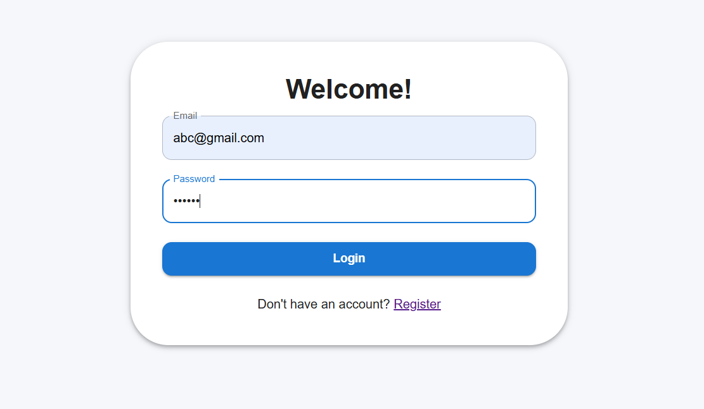
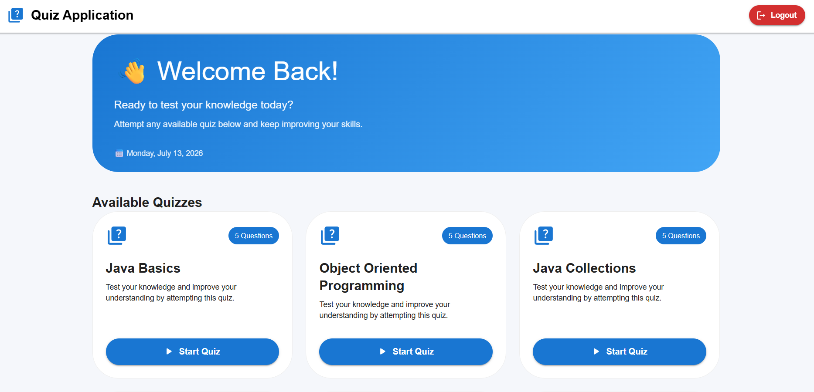
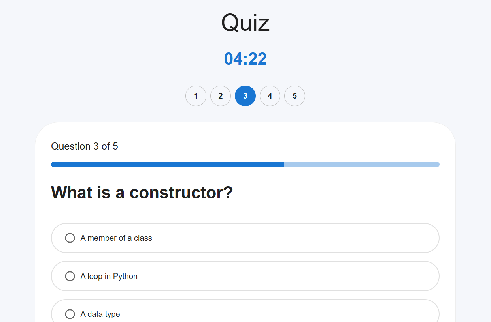
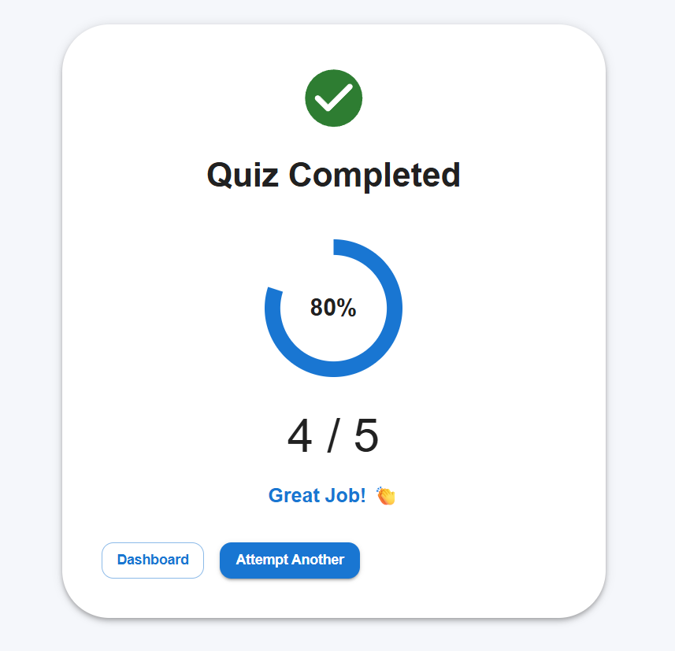
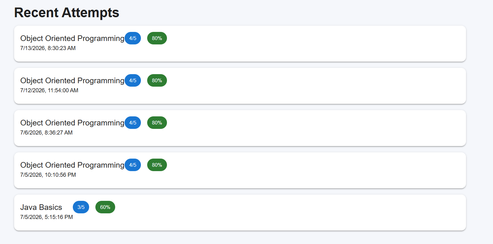

# 🎯 QuizApp

A full-stack Quiz Application built with **Spring Boot**, **React**, and **PostgreSQL**. The application provides secure JWT-based authentication, quiz participation, score tracking, and detailed user statistics through a clean and responsive interface.

## 🌐 Live Demo

[](https://quizapp-delta-sand.vercel.app/)
[](https://github.com/Vishvam16/quizapp)

```

                    +----------------------+
                    |      React (Vite)    |
                    |      Frontend        |
                    |      (Vercel)        |
                    +----------+-----------+
                               |
                        REST APIs (JWT)
                               |
                               ▼
                    +----------------------+
                    | Spring Boot Backend  |
                    |       (Render)       |
                    +----------+-----------+
                               |
                         Spring Data JPA
                               |
                               ▼
                    +----------------------+
                    |     PostgreSQL       |
                    +----------------------+

```

## ✨ Features

- 🔐 Secure JWT Authentication
- 👤 User Registration & Login
- 📝 Attempt Multiple Quizzes
- ⏱️ Timed Quiz Experience
- 📊 Instant Score Calculation
- 📈 Quiz History
- 📉 Performance Statistics
- 📱 Responsive Material UI Interface

---

## 🛠️ Tech Stack

### Backend
- Java 17
- Spring Boot
- Spring Security
- JWT Authentication
- Spring Data JPA
- Hibernate
- PostgreSQL
- Maven

### Frontend
- React
- Vite
- Material UI
- Axios
- React Router

---

## 📂 Project Structure

```text
quizapp/
│
├── src/                     # Spring Boot Backend
├── quiz-app-frontend/       # React Frontend
├── pom.xml
└── README.md
```

---

## 🔐 Authentication

- User Registration
- User Login
- JWT Token Generation
- Protected Routes
- Password Encryption using BCrypt

---

## 📡 REST API

### Authentication

| Method | Endpoint |
|---------|----------|
| POST | `/user/register` |
| POST | `/user/login` |

### Quiz

| Method | Endpoint |
|---------|----------|
| GET | `/quiz/all` |
| GET | `/quiz/{id}/questions` |
| POST | `/quiz/{id}/submit` |

### User

| Method | Endpoint |
|---------|----------|
| GET | `/quiz/history` |
| GET | `/quiz/statistics` |

## 📸 Screenshots

| Login | Dashboard |
|--------|-----------|
|  |  |

| Quiz | Result |
|------|--------|
|  |  |

| Statistics |
|------------|
|  |

## 🚀 Future Enhancements

- Admin dashboard for quiz management
- Create, edit, and delete quizzes
- Quiz categories and difficulty levels
- Leaderboard
- User profile page
- Search and filter quizzes
- Docker Compose setup
- GitHub Actions CI/CD

---

## 👨‍💻 Author

**Vishvam Kunjadiya**

GitHub: https://github.com/Vishvam16
